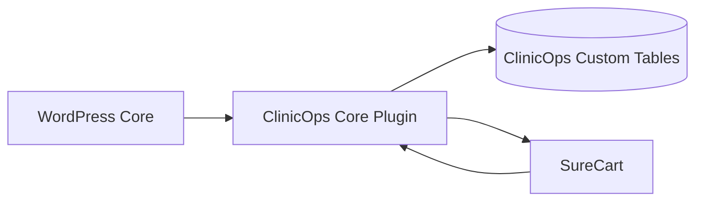
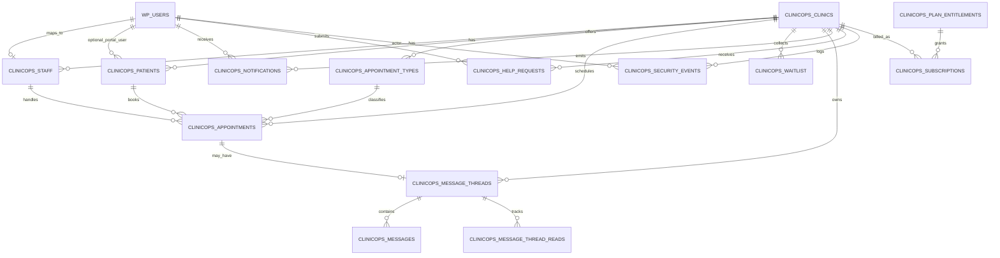

# ClinicOps WordPress + Core Plugin + SureCart Schema

This is the recommended target architecture for moving ClinicOps from Django into:

- WordPress core for site shell, authentication, roles, media, admin UI, and REST
- a custom `clinicops-core` plugin for clinic domain logic and data
- SureCart for products, checkout, customer billing, subscriptions, coupons, and renewals

## Core Decision

Do **not** model appointments, patients, messages, or security logs as posts or post meta.

Use:

- WordPress core tables for users, roles, media, and site settings
- custom plugin tables for clinic operational data
- SureCart as the billing system of record
- a local subscription projection table for fast entitlement checks

That gives you the cleanest separation of concerns and avoids forcing regulated or high-query data into `wp_posts` and `wp_postmeta`.

## System Ownership

| Layer | Owns | Notes |
|---|---|---|
| WordPress Core | `wp_users`, `wp_usermeta`, roles/caps, media attachments, admin screens, REST auth | Identity and platform shell |
| ClinicOps Core Plugin | clinics, staff, patients, appointments, waitlist, messaging, notifications, security, support, local subscription entitlements | All operational clinic logic |
| SureCart | products, prices, checkout, customers, coupons, promotions, subscriptions, invoices, renewals | Commerce and recurring billing |

## Recommended Plugin Structure

```text
wp-content/plugins/clinicops-core/
  clinicops-core.php
  includes/
    bootstrap.php
    activator.php
    installer.php
    roles-capabilities.php
    admin/
      menus.php
      settings-page.php
    api/
      rest-routes.php
      appointments-controller.php
      patients-controller.php
      messages-controller.php
      search-controller.php
    domain/
      clinics/
      staff/
      patients/
      appointment-types/
      appointments/
      waitlist/
      messaging/
      notifications/
      billing/
      security/
      support/
    integrations/
      surecart-hooks.php
      surecart-webhooks.php
      surecart-entitlements.php
    cron/
      reminders.php
      cleanup.php
    encryption/
      field-encrypter.php
      searchable-hashes.php
    repositories/
    services/
  templates/
  assets/
  languages/
```

## WordPress Roles and Capabilities

Map the current Django groups to WordPress roles:

- `clinic_admin`
- `clinic_doctor`
- `clinic_nurse`
- `clinic_frontdesk`
- `clinic_patient`

Keep regular WordPress administrators separate from clinic roles. A site admin is not automatically a clinic admin.

## Data Model Strategy

### 1. Use custom tables for domain data

Use a `wp_clinicops_` prefix for all plugin tables.

### 2. Keep PHI/PII encrypted at the plugin layer

The current app encrypts sensitive fields. Preserve that idea in WordPress by splitting sensitive data into:

- encrypted columns: `*_enc`
- searchable deterministic hashes: `*_hash`

Examples:

- `email_enc` + `email_hash`
- `phone_enc` + `phone_hash`
- `first_name_enc`
- `notes_enc`

That is the safest way to preserve search and privacy together.

### 3. Keep SureCart as billing source of truth

Do not recreate the current billing models one-to-one if SureCart already owns that concern.

Recommended mapping:

- current `Plan` -> local entitlement mapping table + SureCart Product/Price
- current `PromoCode` / `PromoRedemption` -> SureCart Coupons/Promotions, with optional local reporting table only if needed
- current `ClinicSubscription` -> local `wp_clinicops_subscriptions` cache/projection synced from SureCart
- current `PayPalWebhookEvent` -> local `wp_clinicops_surecart_events`

## Local Database Schema

### Tenant and identity

#### `wp_clinicops_clinics`

- `id` BIGINT unsigned PK
- `name` VARCHAR(255) not null
- `slug` VARCHAR(255) unique not null
- `timezone` VARCHAR(64) not null default `UTC`
- `email_enc` LONGTEXT null
- `email_hash` CHAR(64) null
- `phone_enc` LONGTEXT null
- `phone_hash` CHAR(64) null
- `owner_user_id` BIGINT unsigned null -> `wp_users.ID`
- `logo_attachment_id` BIGINT unsigned null -> `wp_posts.ID`
- `brand_color` CHAR(7) not null default `#1d4ed8`
- `is_active` TINYINT(1) not null default `1`
- `created_at_gmt` DATETIME not null

Indexes:

- unique `slug`
- index `owner_user_id`

#### `wp_clinicops_staff`

- `id` BIGINT unsigned PK
- `clinic_id` BIGINT unsigned not null
- `user_id` BIGINT unsigned not null -> `wp_users.ID`
- `staff_role` VARCHAR(32) not null
- `avatar_attachment_id` BIGINT unsigned null -> `wp_posts.ID`
- `is_active` TINYINT(1) not null default `1`
- `created_at_gmt` DATETIME not null

Indexes:

- unique `user_id`
- index `(clinic_id, staff_role, is_active)`

#### `wp_clinicops_patients`

- `id` BIGINT unsigned PK
- `clinic_id` BIGINT unsigned not null
- `user_id` BIGINT unsigned null -> `wp_users.ID`
- `avatar_attachment_id` BIGINT unsigned null -> `wp_posts.ID`
- `first_name_enc` LONGTEXT not null
- `last_name_enc` LONGTEXT not null
- `email_enc` LONGTEXT not null
- `email_hash` CHAR(64) not null
- `phone_enc` LONGTEXT not null
- `phone_hash` CHAR(64) not null
- `dob_enc` LONGTEXT null
- `created_at_gmt` DATETIME not null

Indexes:

- index `(clinic_id, email_hash)`
- index `(clinic_id, phone_hash)`
- index `user_id`

### Scheduling

#### `wp_clinicops_appointment_types`

- `id` BIGINT unsigned PK
- `clinic_id` BIGINT unsigned not null
- `name` VARCHAR(100) not null
- `duration_minutes` INT unsigned not null default `30`
- `price_cents` INT unsigned null
- `is_active` TINYINT(1) not null default `1`
- `created_at_gmt` DATETIME not null

Indexes:

- unique `(clinic_id, name)`

#### `wp_clinicops_appointments`

- `id` BIGINT unsigned PK
- `clinic_id` BIGINT unsigned not null
- `appointment_type_id` BIGINT unsigned null
- `staff_id` BIGINT unsigned not null
- `patient_id` BIGINT unsigned not null
- `start_at_gmt` DATETIME not null
- `end_at_gmt` DATETIME not null
- `status` VARCHAR(16) not null default `scheduled`
- `notes_enc` LONGTEXT null
- `intake_reason_enc` LONGTEXT null
- `intake_details_enc` LONGTEXT null
- `consent_to_treatment` TINYINT(1) not null default `0`
- `consent_to_privacy` TINYINT(1) not null default `0`
- `consent_signature_name_enc` LONGTEXT null
- `consent_signed_at_gmt` DATETIME null
- `cancel_reason_enc` LONGTEXT null
- `confirmation_code` VARCHAR(12) unique null
- `reminder_sent_at_gmt` DATETIME null
- `created_at_gmt` DATETIME not null

Indexes:

- index `(clinic_id, start_at_gmt)`
- index `(staff_id, start_at_gmt)`
- index `(patient_id, start_at_gmt)`
- unique `confirmation_code`

Important:

- enforce overlap checks in plugin service code
- enforce `end_at_gmt > start_at_gmt` in plugin validation
- enforce clinic consistency across appointment, staff, patient, and appointment type

#### `wp_clinicops_waitlist`

- `id` BIGINT unsigned PK
- `clinic_id` BIGINT unsigned not null
- `appointment_type_id` BIGINT unsigned null
- `patient_id` BIGINT unsigned null
- `first_name_enc` LONGTEXT not null
- `last_name_enc` LONGTEXT not null
- `email_enc` LONGTEXT not null
- `email_hash` CHAR(64) not null
- `phone_enc` LONGTEXT not null
- `phone_hash` CHAR(64) not null
- `preferred_start_date` DATE null
- `preferred_end_date` DATE null
- `notes_enc` LONGTEXT null
- `consent_to_contact` TINYINT(1) not null default `1`
- `status` VARCHAR(16) not null default `active`
- `created_at_gmt` DATETIME not null

Indexes:

- index `(clinic_id, status, created_at_gmt)`

### Billing and entitlements

#### `wp_clinicops_plan_entitlements`

- `id` BIGINT unsigned PK
- `plan_key` VARCHAR(64) not null unique
- `label` VARCHAR(100) not null
- `surecart_product_id` VARCHAR(64) not null
- `surecart_price_id` VARCHAR(64) not null
- `billing_interval` VARCHAR(16) not null
- `is_free` TINYINT(1) not null default `0`
- `staff_limit` INT unsigned null
- `service_limit` INT unsigned null
- `monthly_appointment_limit` INT unsigned null
- `includes_reminders` TINYINT(1) not null default `1`
- `includes_notifications` TINYINT(1) not null default `1`
- `includes_messaging` TINYINT(1) not null default `1`
- `includes_waitlist` TINYINT(1) not null default `1`
- `includes_custom_branding` TINYINT(1) not null default `1`
- `is_active` TINYINT(1) not null default `1`
- `created_at_gmt` DATETIME not null
- `updated_at_gmt` DATETIME not null

Purpose:

- maps SureCart catalog items to ClinicOps feature limits
- replaces the old local `Plan` model

#### `wp_clinicops_subscriptions`

- `id` BIGINT unsigned PK
- `clinic_id` BIGINT unsigned not null
- `owner_user_id` BIGINT unsigned null -> `wp_users.ID`
- `plan_entitlement_id` BIGINT unsigned null
- `surecart_customer_id` VARCHAR(64) not null
- `surecart_subscription_id` VARCHAR(64) not null
- `surecart_product_id` VARCHAR(64) not null
- `surecart_price_id` VARCHAR(64) not null
- `status` VARCHAR(20) not null
- `started_at_gmt` DATETIME null
- `current_period_end_gmt` DATETIME null
- `cancel_at_period_end` TINYINT(1) not null default `0`
- `last_event_type` VARCHAR(64) null
- `created_at_gmt` DATETIME not null
- `updated_at_gmt` DATETIME not null

Indexes:

- unique `surecart_subscription_id`
- index `(clinic_id, status)`
- index `surecart_customer_id`

Purpose:

- local access-control cache for plan gating
- fast lookup for clinic entitlements
- local history of subscription state even though SureCart remains the billing source of truth

#### `wp_clinicops_surecart_events`

- `id` BIGINT unsigned PK
- `event_id` VARCHAR(128) not null unique
- `event_type` VARCHAR(128) not null
- `resource_type` VARCHAR(64) null
- `resource_id` VARCHAR(128) null
- `status` VARCHAR(20) not null default `received`
- `payload_json` LONGTEXT not null
- `error_message` LONGTEXT null
- `subscription_id` BIGINT unsigned null
- `received_at_gmt` DATETIME not null
- `processed_at_gmt` DATETIME null

Purpose:

- idempotency
- webhook/audit logging
- replay-safe async processing

### Notifications and messaging

#### `wp_clinicops_notifications`

- `id` BIGINT unsigned PK
- `clinic_id` BIGINT unsigned null
- `recipient_user_id` BIGINT unsigned not null
- `actor_user_id` BIGINT unsigned null
- `event_type` VARCHAR(64) not null
- `level` VARCHAR(16) not null default `info`
- `title` VARCHAR(140) not null
- `body` LONGTEXT null
- `link` VARCHAR(255) null
- `metadata_json` LONGTEXT null
- `is_read` TINYINT(1) not null default `0`
- `read_at_gmt` DATETIME null
- `created_at_gmt` DATETIME not null

#### `wp_clinicops_messaging_permissions`

- `id` BIGINT unsigned PK
- `clinic_id` BIGINT unsigned not null
- `role` VARCHAR(32) not null
- `access_level` VARCHAR(16) not null default `none`
- `updated_at_gmt` DATETIME not null

Indexes:

- unique `(clinic_id, role)`

#### `wp_clinicops_message_threads`

- `id` BIGINT unsigned PK
- `clinic_id` BIGINT unsigned not null
- `patient_id` BIGINT unsigned not null
- `appointment_id` BIGINT unsigned null
- `subject` VARCHAR(140) null
- `source` VARCHAR(16) not null default `portal`
- `status` VARCHAR(16) not null default `open`
- `last_message_sender_type` VARCHAR(16) not null default `patient`
- `last_message_excerpt` VARCHAR(180) null
- `last_message_at_gmt` DATETIME not null
- `created_at_gmt` DATETIME not null
- `updated_at_gmt` DATETIME not null

Indexes:

- index `(clinic_id, status, last_message_at_gmt)`
- index `(patient_id, last_message_at_gmt)`
- unique `appointment_id` when not null

#### `wp_clinicops_messages`

- `id` BIGINT unsigned PK
- `thread_id` BIGINT unsigned not null
- `sender_user_id` BIGINT unsigned null
- `sender_type` VARCHAR(16) not null
- `sender_label` VARCHAR(150) null
- `body_enc` LONGTEXT not null
- `created_at_gmt` DATETIME not null

Indexes:

- index `(thread_id, created_at_gmt)`

#### `wp_clinicops_message_thread_reads`

- `id` BIGINT unsigned PK
- `thread_id` BIGINT unsigned not null
- `user_id` BIGINT unsigned not null
- `last_read_at_gmt` DATETIME not null

Indexes:

- unique `(thread_id, user_id)`
- index `(user_id, last_read_at_gmt)`

### Support and security

#### `wp_clinicops_help_requests`

- `id` BIGINT unsigned PK
- `clinic_id` BIGINT unsigned not null
- `submitted_by_user_id` BIGINT unsigned null
- `request_type` VARCHAR(16) not null
- `status` VARCHAR(16) not null default `new`
- `category` VARCHAR(32) null
- `priority` VARCHAR(16) not null default `medium`
- `subject` VARCHAR(140) not null
- `details_enc` LONGTEXT not null
- `business_impact_enc` LONGTEXT null
- `page_url` VARCHAR(255) null
- `user_agent` VARCHAR(255) null
- `reporter_name` VARCHAR(150) null
- `reporter_email` VARCHAR(254) null
- `staff_role` VARCHAR(32) null
- `internal_notes_enc` LONGTEXT null
- `resolved_at_gmt` DATETIME null
- `created_at_gmt` DATETIME not null
- `updated_at_gmt` DATETIME not null

#### `wp_clinicops_security_events`

- `id` BIGINT unsigned PK
- `clinic_id` BIGINT unsigned null
- `user_id` BIGINT unsigned null
- `event_type` VARCHAR(64) not null
- `identifier` VARCHAR(254) null
- `ip_address` VARCHAR(64) null
- `country_code` CHAR(2) null
- `user_agent` VARCHAR(255) null
- `request_path` VARCHAR(255) null
- `metadata_json` LONGTEXT null
- `created_at_gmt` DATETIME not null

Indexes:

- index `(clinic_id, created_at_gmt)`
- index `(user_id, created_at_gmt)`
- index `(event_type, created_at_gmt)`

#### `wp_clinicops_security_access_rules`

- `id` BIGINT unsigned PK
- `name` VARCHAR(100) not null
- `action` VARCHAR(16) not null
- `target_type` VARCHAR(16) not null
- `scope` VARCHAR(16) not null default `auth`
- `value` VARCHAR(64) not null
- `note` LONGTEXT null
- `is_active` TINYINT(1) not null default `1`
- `created_at_gmt` DATETIME not null
- `updated_at_gmt` DATETIME not null

Indexes:

- unique `(action, target_type, scope, value)`
- index `(scope, is_active)`

#### `wp_clinicops_two_factor_recovery_codes`

- `id` BIGINT unsigned PK
- `user_id` BIGINT unsigned not null
- `code_hash` CHAR(64) not null
- `code_suffix` VARCHAR(6) not null
- `consumed_at_gmt` DATETIME null
- `created_at_gmt` DATETIME not null

Indexes:

- index `(user_id, consumed_at_gmt)`

## SureCart Integration Schema

### What SureCart should own

Use SureCart for:

- product and price definition
- checkout and payment collection
- subscriptions and renewals
- invoices and order records
- coupons and first-payment discounts

### What the plugin should mirror locally

Mirror only the fields the clinic app needs for authorization and feature gating:

- subscription status
- current period end
- cancel-at-period-end
- linked clinic
- linked WordPress owner user
- linked SureCart product/price IDs

### Sync strategy

If SureCart is installed on the same WordPress site:

- use SureCart WordPress actions for immediate in-process updates
- keep a webhook endpoint or event log for audit and recovery

Primary events to handle:

- `subscription.created`
- `subscription.updated`
- `subscription.made_active`
- `subscription.canceled`
- `subscription.renewed`

The SureCart developer docs also expose WordPress actions for subscription lifecycle events such as `surecart/subscription_renewed`.

### Processing rule

Never do heavy billing sync inline in the webhook request.

Recommended flow:

1. receive event
2. verify/store event
3. return `2xx` fast
4. queue background sync
5. update `wp_clinicops_subscriptions`
6. recalculate clinic entitlements

## Domain Flow



## ER Summary



## Current Django Model Mapping

| Current model | WordPress target |
|---|---|
| `Clinic` | `wp_clinicops_clinics` |
| `Staff` | `wp_clinicops_staff` |
| `Patient` | `wp_clinicops_patients` |
| `AppointmentType` | `wp_clinicops_appointment_types` |
| `Appointment` | `wp_clinicops_appointments` |
| `WaitlistEntry` | `wp_clinicops_waitlist` |
| `Notification` | `wp_clinicops_notifications` |
| `ClinicMessagingPermission` | `wp_clinicops_messaging_permissions` |
| `MessageThread` | `wp_clinicops_message_threads` |
| `Message` | `wp_clinicops_messages` |
| `MessageThreadReadState` | `wp_clinicops_message_thread_reads` |
| `HelpRequest` | `wp_clinicops_help_requests` |
| `SecurityEvent` | `wp_clinicops_security_events` |
| `SecurityAccessRule` | `wp_clinicops_security_access_rules` |
| `TwoFactorRecoveryCode` | `wp_clinicops_two_factor_recovery_codes` |
| `Plan` | `wp_clinicops_plan_entitlements` + SureCart Product/Price |
| `PromoCode` / `PromoRedemption` | SureCart Coupons/Promotions, optional local reporting table |
| `ClinicSubscription` | `wp_clinicops_subscriptions` |
| `PayPalWebhookEvent` | `wp_clinicops_surecart_events` |

## Recommended Build Order

1. Create `clinicops-core` plugin shell
2. Register roles and capabilities
3. Create database installer for custom tables
4. Build clinic, staff, patient, and appointment repositories/services
5. Build plan entitlement table and subscription sync service
6. Connect SureCart lifecycle hooks
7. Build reminder jobs and notification service
8. Build messaging and security modules
9. Port admin pages and REST endpoints

## Final Recommendation

The clean WordPress version of ClinicOps should be:

- a custom plugin with its own tables
- not a post-meta-heavy build
- not a one-to-one rewrite of the old billing models
- SureCart for billing, with a thin local subscription projection for access control

That structure will survive scaling better and keep the clinical domain separate from commerce.
